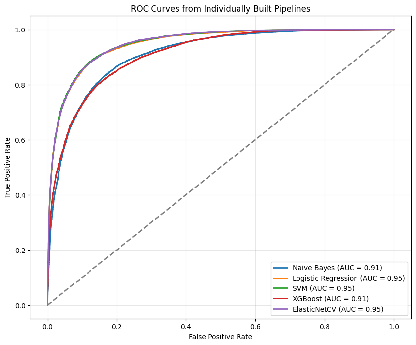
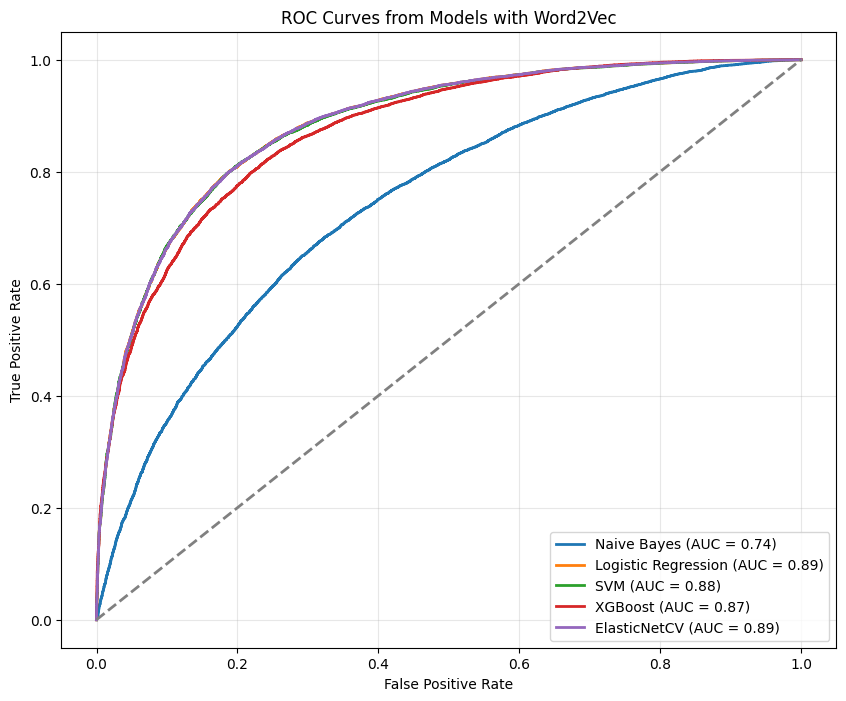

# Sentiment_analysis

## Summary

This project explores the use of embeddings or LLMs to improve the performance of text classification models. Our goal is to choose an appropriate representation of words. To do so, we begin by cleaning the data using regular expressions, then we extract tokens which we subsequently transform into lemmas. We weight these lemmas using the TF-IDF (term frequency–inverse document frequency) method.

This approach has some limitations: it ignores word order and yields a sparse representation, which can lead to issues with dimensionality and computational complexity. To address these, we can use a denser representation in which each word is projected into a vector of freely chosen size. This method, called Word2Vec, relies on the skip-gram approach and considers the local context of words, whereas a LLM such as BERT handles a broader context.

Once the words are represented, we apply various classification methods (Naive Bayes, SVM, Logistic Regression, or ElasticNet) to classify the documents. Finally, we leverage a pretrained LLM model—BERT—to further improve overall performance. To evaluate our results, we measure Precision, Recall, F1-score, and Accuracy. Since the data is balanced, using Accuracy alone can suffice for performance evaluation.

### Model performance using TF-IDF

The table below shows the performance of different classification models using the TF-IDF method:

| Model              | Accuracy | F1-score | Precision | Recall |
|--------------------|----------|----------|-----------|--------|
| Naive Bayes        | 0.83     | 0.81     | 0.87      | 0.77   |
| Logistic Regression| 0.88     | 0.88     | 0.88      | 0.88   |
| SVM                | 0.88     | 0.88     | 0.88      | 0.88   |
| XGB                | 0.82     | 0.83     | 0.80      | 0.86   |
| ElasticNet         | 0.88     | 0.88     | 0.88      | 0.88   |

Logistic Regression, SVM, and ElasticNet all achieve a score of 0.88 on Accuracy, F1-score, Precision, and Recall, while Naive Bayes and XGB perform slightly lower. The ROC curve is provided below.

### Model performance using Word2Vec

The table below shows the performance of different classification models using the Word2Vec method:

| Model              | Accuracy | F1-score | Precision | Recall |
|--------------------|----------|----------|-----------|--------|
| Naive Bayes        | 0.68     | 0.67     | 0.69      | 0.64   |
| Logistic Regression| 0.81     | 0.80     | 0.81      | 0.81   |
| SVM                | 0.81     | 0.81     | 0.80      | 0.81   |
| XGB                | 0.79     | 0.79     | 0.79      | 0.78   |
| ElasticNet         | 0.81     | 0.81     | 0.81      | 0.80   |

The performance of the classification models using Word2Vec is slightly lower than that obtained with TF-IDF. Logistic Regression, SVM, and ElasticNet all reach a score of 0.80 on Accuracy, F1-score, Precision, and Recall, while Naive Bayes and XGB perform slightly lower. The ROC curve is shown below. This difference between the two methods can be explained by the fact that the Word2Vec parameters have not been optimized. The ROC curve is provided below.

### Model performance using BERT

The table below shows the performance of the classification model using BERT:

| Model | Accuracy | F1-score | Precision | Recall |
|-------|----------|----------|-----------|--------|
| BERT  | 0.89     | 0.89     | 0.89      | 0.88   |

The BERT model performs slightly better than both TF-IDF and Word2Vec with an Accuracy of 0.89. 